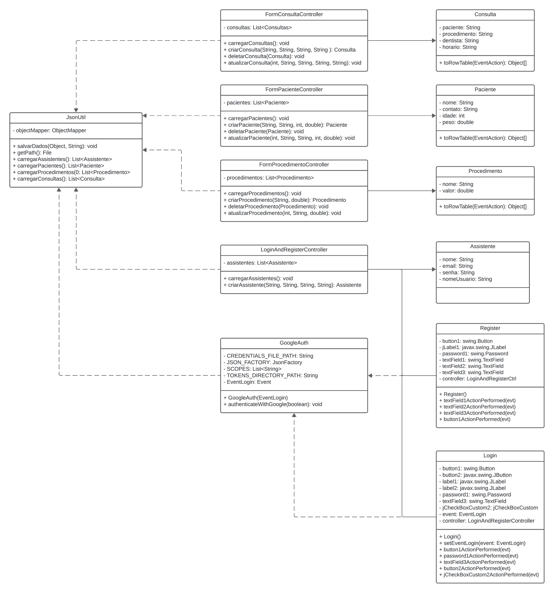

  

  
  

<h1>Sobre Java Smile</h1>

Java Smile é um sistema de gerenciamento clínico odontológico. Acreditamos ser uma ótima opção para facilitar o gerenciamento 
  e atendimento aos pacientes, suprindo as necessidades de:

<ul>
  <li>Listagem de Pacientes, Consultas e Procedimentos.</li>
  <li>Persistência de dados (Local) em arquivo Json.</li>
  <li>Criação, edição e remoção dos mesmos.</li>
  <li>Cadastro via informações do usuário.</li>
  <li>Login via Usuário e senha ou via Google.</li>
</ul>

  
Diagrama de Classes

  

<h2>Dependências e versões necessárias</h2>
<ul>
    <li>MigLayout 4.0</li>
    <li>TimmingFramework 0.55</li>
</ul>

<h2>Instrução de uso:</h2>
<ol>
    <li>Execute o arquivo jar.</li>
    <li>Faça cadastro de usuário ou entre com Google.</li>
    <li>Faça login(Caso seja feito cadastro no passo 2).</li>
    <li>Utilize o sistema.</li>
</ol>

<h1>Interfaces</h1>

  

  
Login e Registro

  

  
Dashboard

  

  
Listagem de Pacientes

  

  
Listagem de Procedimentos

  

  
Listagem de Consultas

<h2>Licença</h2>
Este projeto usa a [Apache License 2.0](https://www.apache.org/licenses/LICENSE-2.0) com a [Commons Clause](https://commonsclause.com/) para restringir o uso comercial. Veja o arquivo [LICENSE.md](LICENSE.md) para mais detalhes.
